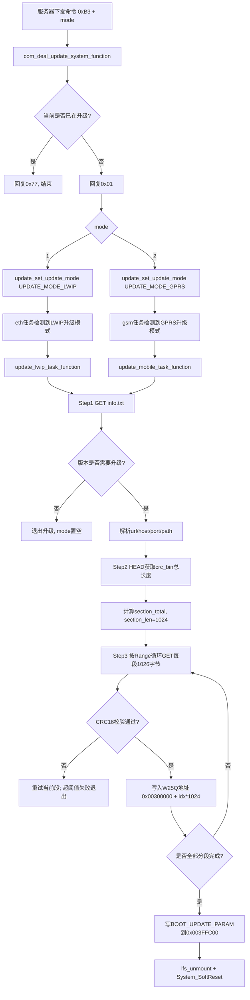
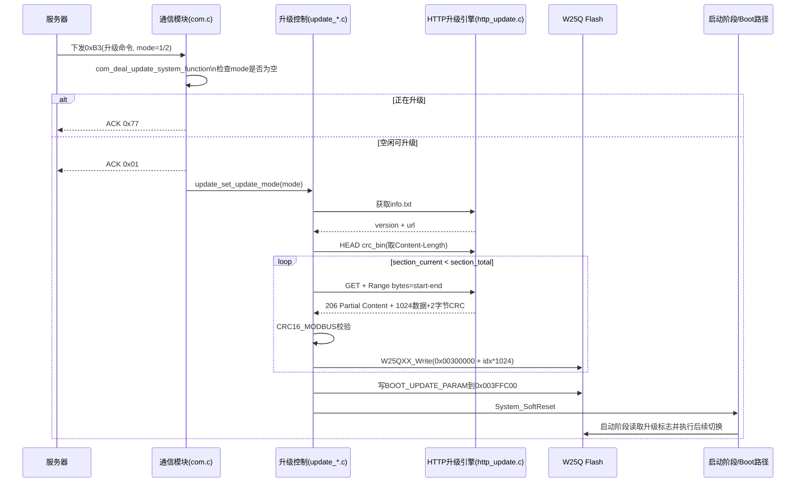

# 摄像头运维终端物联网节点设计

## 使用芯片列表

> 说明：以下为根据仓库内驱动文件、工程配置与文档可识别到的芯片/模组型号。

| 类别 | 型号 | 依据文件（示例） |
| --- | --- | --- |
| 主控 MCU | STM32F407VGTx（STM32F4 系列） | `USER/Template.uvprojx` |
| 以太网 PHY | LAN8720 | `APP/DRIVER/src/lan8720.c` |
| 三轴加速度传感器 | LIS3DH | `APP/DRIVER/src/lis3dh_driver.c` |
| 温湿度传感器 | AHT20 | `APP/DRIVER/src/aht20_drv.c` |
| 电能计量芯片 | BL0910 | `APP/DRIVER/src/BL0910.c`、`APP/DRIVER/src/BL0910_spi.c` |
| 电能计量芯片 | BL0939 | `APP/DRIVER/src/BL0939.c` |
| 电能计量芯片 | RN8207C | `APP/DRIVER/src/RN8207C.c` |
| 外部 SPI Flash | W25Qxx（代码注释出现 W25Q64） | `APP/DRIVER/src/w25qxx.c`、`HARDWARE/src/elec_soft_spi.c` |
| 4G/GNSS 模组系列 | ML302A / ML307A | `APP/DRIVER/src/# GNSS用户手册（4G系列）.md` |

## 当前架构设计分析

### 1) 架构分层
- **硬件与驱动层**（`HARDWARE/*`、`APP/DRIVER/*`）：封装 GPIO/ADC/SPI/UART/RS485/RTC/IWDG/RNG 以及各芯片驱动（LAN8720、AHT20、LIS3DH、BL0910/BL0939/RN8207C、W25Qxx）。  
- **系统与中间件层**（`UCOSII/*`、`LWIP/*`、`LITTLEFS/*`）：提供任务调度、网络协议栈和 Flash 文件系统能力。  
- **业务服务层**（`APP/USER/*`、`APP/TASK/*`）：实现参数管理、采集检测、通信封装、链路管理、升级流程。  
- **应用编排层**（`APP/TASK/src/app.c`）：统一调度采集、上报、存储、控制与故障处理状态机。  

### 2) 启动与任务模型
- 启动入口在 `APP/USER/src/start.c`，完成外设初始化、参数加载、升级状态初始化。  
- 通过 uC/OS-II 创建核心任务：`app_task`（业务主循环）、`det_task`（采集检测）、`eth_task`（以太网链路）、`gsm_task`（4G链路）等。  
- 采用“多任务并行 + 看门狗保活 + 异常软复位”模式，保障现场设备长期运行稳定性。  

### 3) 双链路通信架构
- **有线链路**：`APP/TASK/src/eth.c` 配合 `LWIP/lwip_app/*`，负责 LAN8720 链路检测、TCP/UDP、Web、ONVIF、RTSP、SNMP、NTP、Ping/端口扫描。  
- **无线链路**：`APP/TASK/src/gsm.c` + `APP/DRIVER/src/GPRS.c`/`GPS.c`，负责 4G 注网、重连、数据传输与 GNSS 数据。  
- **统一发送策略**：`APP/USER/src/com.c` 与 `app.c` 组合实现报文封装、应答处理、链路优先级与故障切换。  

### 4) 数据与控制闭环
- `det.c` 周期采集传感器/计量数据并进行状态判定（温湿度、姿态、水浸、门磁、电源、SIM、网络健康）。  
- `app.c` 根据状态触发告警、立即上报、继电器保护和恢复流程。  
- `save.c` + littlefs 将设备参数、网络参数、阈值与升级配置持久化到外部 Flash。  

### 5) 升级与可靠性设计
- 升级模块位于 `APP/UPDATE/src/*` 与 `APP/TASK/src/http_update.c`，支持 GSM/LWIP 两路径升级。  
- 升级流程覆盖版本检查、分段下载、完整性校验和重启切换。  
- 架构内置 PVD/BOR（低压/掉电保护）、IWDG、异常重启与参数恢复机制，适配边缘设备部署场景。  

## 文件夹结构

```text
fangyun-ac-bak/
├─ APP/                  # 业务应用代码（驱动、任务、升级、工具、用户逻辑）
│  ├─ DRIVER/src/        # 芯片与外设驱动实现
│  ├─ TASK/src/          # 业务任务（app/det/eth/gsm/http_update）
│  ├─ UPDATE/src/        # 升级流程与Boot/IAP逻辑
│  ├─ TOOL/src/          # 通用算法与编解码工具
│  ├─ USER/src/          # 启动、通信与参数存储核心
│  └─ PRINT/             # 打印与组播调试组件
├─ CORE/                 # Cortex-M4 启动与内核头文件
├─ FWLIB/                # STM32外设库、以太网驱动、加密库
├─ HARDWARE/             # 板级外设抽象（inc/src）
├─ INCLUDE/              # 全局配置与公共头文件
├─ LITTLEFS/             # littlefs 文件系统移植与源码
├─ LWIP/                 # lwIP协议栈与应用层协议模块
├─ MALLOC/               # 动态内存管理
├─ SEGGER/               # 调试与异常回溯组件
├─ SYSTEM/               # 系统时钟与延时基础模块
├─ TEST/                 # 测试资料与协议文档
├─ UCOSII/               # uC/OS-II 内核、移植与配置
├─ USER/                 # 工程入口与Keil工程配置
└─ 芯片列表.md            # 芯片/架构说明文档
```

## 文件内容概述（按目录）

| 目录 | 内容概述 | 代表文件 |
| --- | --- | --- |
| `USER/` | 工程入口与中断、系统初始化、Keil工程配置。 | `main.c`、`stm32f4xx_it.c`、`Template.uvprojx` |
| `APP/USER/src` | 系统启动、通信协议封装、参数读写与持久化入口。 | `start.c`、`com.c`、`save.c` |
| `APP/TASK/src` | 运行态任务编排：主循环、检测、以太网、4G、HTTP升级任务。 | `app.c`、`det.c`、`eth.c`、`gsm.c`、`http_update.c` |
| `APP/DRIVER/src` | 传感器、计量、通信与存储芯片驱动实现。 | `lan8720.c`、`aht20_drv.c`、`lis3dh_driver.c`、`BL0939.c`、`w25qxx.c` |
| `APP/UPDATE/src` | Boot/IAP 与分链路升级控制流程。 | `bootload.c`、`iap.c`、`update_http.c`、`update_lwip.c`、`update_gsm.c` |
| `APP/TOOL/src` | 加密摘要、CRC、JSON与编解码基础工具。 | `aes.c`、`md5.c`、`SHA1.c`、`crc.c`、`cJSON.c` |
| `APP/PRINT` | 本地打印与UDP组播输出相关模块。 | `print.c`、`udp_multicast.c` |
| `LWIP/lwip_app` | 网络应用层能力：TCP/UDP、Web、ONVIF、RTSP、SNMP、NTP、扫描与Ping。 | `tcp_client/tcp_client.c`、`web_server/httpd.c`、`onvif/onvif.c` |
| `LITTLEFS/` | 外部Flash文件系统核心与移植层。 | `lfs.c`、`lfs_util.c`、`lfs_port.c` |
| `UCOSII/` | RTOS核心、CPU移植层与编译配置。 | `CORE/os_task.c`、`PORT/os_cpu_c.c`、`CONFIG/os_cfg.h` |
| `HARDWARE/` | 板级通用外设驱动与硬件接口封装。 | `src/*`、`inc/*` |
| `FWLIB/` | STM32标准外设库、以太网驱动、密码学库。 | `STM32F4xx_StdPeriph_Driver`、`STM32F4x7_ETH_Driver`、`STM32_Cryptographic` |
| `SYSTEM/` | 系统延时、时钟与底层系统函数。 | `delay.c`、`sys.c` |
| `MALLOC/` | 内存池管理与动态分配实现。 | `malloc.c` |
| `SEGGER/` | 调试追踪、HardFault处理与回溯支持。 | `CmBacktrace`、`RTT Viewer` |
| `TEST/` | 测试与协议资料归档。 | `数据上报.md` |

## 仓库功能总结

- 基于 **STM32F4 + UCOSII** 的嵌入式设备固件框架。  
- 集成 **4G 通信与 GNSS** 能力，支持设备联网、定位与远程交互。  
- 集成 **以太网 + LWIP 协议栈**，包含 TCP/UDP、Web、NTP、SNMP、RTSP、ONVIF、端口扫描与 Ping 等网络功能。  
- 提供 **多种传感与计量采集**：电能计量（BL0910/BL0939/RN8207C）、温湿度（AHT20）、加速度（LIS3DH）等。  
- 提供 **多接口外设支持**：RS485、USART、SPI、RTC、看门狗、随机数、Flash 存储等硬件驱动。  
- 提供 **本地与远程升级机制**，支持 Bootloader/IAP 以及 GSM/HTTP/LWIP 升级路径。  
- 包含 **常用工具链能力**：AES/MD5/SHA1、CRC、JSON（cJSON）与编解码等基础组件。  

## 功能模块详细梳理（补充保留）

### 1) 系统启动与任务调度（`APP/USER/src/start.c`）
- 完成上电初始化：看门狗、LED、继电器、按键、RTC、RNG、RS485、SPI Flash、传感器与计量芯片初始化。  
- 初始化参数与存储：挂载 littlefs、读取本地配置、初始化升级状态。  
- 创建并调度多任务：应用主任务、检测任务、以太网任务、GSM任务、打印任务等。  
- 包含掉电/低压相关保护流程（PVD/BOR 相关处理）与软复位路径。  

### 2) 应用主控与业务编排（`APP/TASK/src/app.c`）
- 作为主业务循环，统一编排：采集检测、参数存储、通信接收处理、数据发送、服务器链路管理。  
- 管理上报与控制状态机：心跳、周期上报、配置应答、故障码、发送重试、通信通道切换。  
- 管理继电器/适配器开关与系统重启触发逻辑。  
- 提供故障触发后的“立即上报 + 保护动作”联动能力。  

### 3) 采集与告警检测（`APP/TASK/src/det.c`）
- 采集环境与设备状态：温湿度（AHT20）、电能/电参（BL0939/BL0910）、门磁、水浸、SIM状态、按键。  
- 支持姿态角度判断（LIS3DH 数据处理与倾斜角计算逻辑）。  
- 监测主网络与摄像头网络健康状态，并输出状态码供上报使用。  
- 支持按键恢复默认、擦除配置/存储、触发重启等维护操作。  

### 4) 通信协议封装与数据上报（`APP/USER/src/com.c`）
- 实现设备上报帧打包：`QN/TID/VER/CP` 等字段组装、长度与校验处理。  
- 汇聚各子模块状态（网络、摄像头、供电、温湿度、门磁、姿态、防雷等）生成上报内容。  
- 支持查询/配置交互对应的响应封装，作为设备与平台通信核心适配层。  

### 5) 有线网络与协议栈（`APP/TASK/src/eth.c` + `LWIP/lwip_app/*`）
- 链路管理：基于 LAN8720 做网线检测、LWIP 启停、异常复位、指示灯状态控制。  
- 连接管理：TCP 客户端/服务端状态机、UDP/组播通道管理、DNS 解析与重连控制。  
- 网络探测：主/备网络 ping 检测、摄像头连通性检测、异常超时判定。  
- 上层协议能力：  
  - Web 配置界面（CGI/SSI，参数配置与状态展示）  
  - ONVIF 摄像头发现与维护（含厂商协议适配）  
  - RTSP 能力检测与会话控制  
  - 端口扫描与一次性扫描任务  
  - SNMP 信息采集/查询接口  

### 6) 无线通信与定位（`APP/TASK/src/gsm.c` + `APP/DRIVER/src/GPRS.c`/`GPS.c`）
- 4G/GPRS 模组状态机：初始化、注网检测、TCP 建连、断线重连、异常复位。  
- 与有线网络协同：支持有线/无线优先策略下的通道切换。  
- 支持数据通道发送与升级模式切换（普通通信 vs 升级通信）。  
- 支持 GNSS 相关数据获取与上报链路对接。  

### 7) 升级系统（`APP/UPDATE/src/*.c` + `APP/TASK/src/http_update.c`）
- 统一升级控制参数（升级模式、服务器地址、端口、状态）。  
- 支持通过有线与无线两条路径执行 HTTP 升级流程。  
- 升级步骤包含：版本检查（`info.txt`）、升级包大小确认、分段下载、数据完整性校验、成功后重启。  
- 升级流程与业务通信解耦，升级期间主动处理连接切换与资源占用。  

### 8) 参数存储与持久化（`APP/USER/src/save.c` + `LITTLEFS/*`）
- 使用 littlefs 在外部 Flash 上保存网络参数、设备参数、阈值、升级地址、上报开关等配置。  
- 支持默认参数回填、恢复出厂、分项清除与重新落盘。  
- 包含 MAC 参数生成/读取与本地网络参数初始化逻辑。  

### 9) 驱动与硬件抽象层（`APP/DRIVER/*` + `HARDWARE/*`）
- 传感与计量驱动：AHT20、LIS3DH、BL0910、BL0939、RN8207C。  
- 网络/存储驱动：LAN8720、W25Qxx、STM Flash。  
- 基础外设驱动：ADC、SPI、UART、RS485、RTC、DMA、IWDG、RNG、GPIO。  
- 为上层任务提供统一硬件访问接口，屏蔽具体时序细节。  

### 10) 通用算法与工具组件（`APP/TOOL/*`）
- 提供加解密与摘要能力：AES、MD5、SHA1。  
- 提供数据处理基础组件：CRC、JSON（cJSON/mycJSON）、队列与编解码工具。  
- 为通信、升级、配置解析等场景提供基础库支撑。

---

## 配置参数

> 来源文件：`APP/USER/inc/save.h`、`APP/USER/src/save.c`

### 本地网络默认参数

| 参数 | 宏定义 | 默认值 | 说明 |
| --- | --- | --- | --- |
| 本地 IP | `DEFALUT_LOCAL_IP0~3` | `192.168.1.30` | 设备静态 IP 地址 |
| 子网掩码 | `DEFALUT_NETMASK0~3` | `255.255.255.0` | C 类网络掩码 |
| 默认网关 | `DEFALUT_GATEWAY0~3` | `192.168.1.1` | 路由器出口地址 |
| DNS | `DEFALUT_DNS0~3` | `114.114.114.114` | 公共 DNS 服务器 |
| 组播 IP | `DEFALUT_MULTICAST_IP0~3` | `239.255.255.249` | 设备发现组播地址 |
| 组播端口 | `DEFALUT_MULTICAST_PORT` | `65000` | 组播通信端口 |
| 服务器模式 | `DEFALUT_SERVERMODE` | `4`（自动模式） | 1-主模式 2-备模式 4-自动 |

### 远程服务器默认参数

| 参数 | 默认值 | 说明 |
| --- | --- | --- |
| 外网域名/IP | `test1.fnwlw.net` | 公网服务器地址 |
| 外网端口 | `6102` | 公网通信端口 |
| 内网域名/IP | `test1.fnwlw.net` | 局域网服务器地址 |
| 内网端口 | `6102` | 局域网通信端口 |

### 通信定时参数默认值

| 参数 | 宏定义 | 默认值 | 说明 |
| --- | --- | --- | --- |
| 心跳间隔 | `DEFALUT_HEART` | `90 000 ms`（90 s） | 心跳包发送周期 |
| 上报间隔 | `DEFALUT_REPORT` | `180 000 ms`（180 s） | 状态定时上报周期 |
| 网络 Ping 间隔 | `DEFALUT_PING` | `20 000 ms`（20 s） | 网络连通性探测周期 |
| 设备 Ping 间隔 | `DEFALUT_DEV_PING` | `10 000 ms`（10 s） | 摄像头连通性探测周期 |
| 网络延时时间 | `DEFALUT_NETWORK_DELAY` | `200`（单位：ms） | 网络延迟检测时间阈值（20220308） |
| ONVIF 搜索间隔 | `DEFALUT_ONVIF_TIME` | `120`（单位：分钟） | ONVIF 摄像头定期重搜周期（20230811） |
| 定时重启间隔 | `DEFALUT_RELOAD_TIME` | `48 × 3600 s`（48 h） | 设备定时自动重启周期（20240904） |

### 设备身份默认参数

| 参数 | 宏定义 | 默认值 | 说明 |
| --- | --- | --- | --- |
| 设备密码 | `DEFALUT_PASSWORD` | `"88888888"` | 出厂默认登录密码，首次开机须修改 |
| 软件版本 | `SOFT_NO_STR` | `"FN-ST-BJ-01-1.0.0.20250327"` | 当前固件版本号 |
| 硬件版本 | `HARD_NO_STR` | `"FN-ST-BJ-01"` | 硬件型号标识 |

### 硬件阈值默认参数

| 参数 | 宏定义 | 默认值 | 说明 |
| --- | --- | --- | --- |
| 电压上限 | `DEFALUT_VOLT_MAX` | `0`（不启用） | 过压保护阈值（0 表示未配置） |
| 电压下限 | `DEFALUT_VOLT_MIN` | `0`（不启用） | 欠压保护阈值（0 表示未配置） |
| 电流上限 | `DEFALUT_CURRENT_MAX` | `0`（不启用） | 过载保护阈值（0 表示未配置） |
| 角度阈值 | `DEFAULT_ANGLE` | `40°` | 姿态倾斜保护角度（LIS3DH） |
| 温度上限 | `DEFALUT_TEMP_HIGH` | `60 ℃` | 箱体过温保护上限 |
| 温度下限 | `DEFALUT_TEMP_LOW` | `1 ℃` | 箱体低温保护下限 |
| 湿度上限 | `DEFALUT_HUMI_HIGH` | `80 %RH` | 环境高湿控制触发点 |
| 湿度下限 | `DEFAULT_HUMI_LOW` | `10 %RH` | 环境低湿控制触发点 |
| 加热启动温度 | `DEFALUT_HEAT_UP` | `-20 ℃` | 加热器启动下限温度 |
| 加热停止温度 | `DEFALUT_HEAT_DOWN` | `-5 ℃` | 加热器停止上限温度 |
| 补光灯开启时间 | `DEFALUT_LIGHT_OPEN_TIME` | `720`（min，即 12:00） | 补光灯每日开启时刻 |
| 补光灯关闭时间 | `DEFALUT_LIGHT_CLOSE_TIME` | `720`（min，即 12:00） | 补光灯每日关闭时刻 |
| 门控开启时间 | `DEFALUT_DOOR_OPEN_TIME` | `720`（min，即 12:00） | 门控每日开启时刻 |
| 门控关闭时间 | `DEFALUT_DOOR_CLOSE_TIME` | `720`（min，即 12:00） | 门控每日关闭时刻 |
| 滤波系数 | `DEFAULT_MIU` | `25` | 通用滤波 / 补偿系数 |

### Flash 存储文件映射

| 文件名（LittleFS） | 保存宏 | 存储内容 |
| --- | --- | --- |
| `network_name` | `SAVE_LOCAL_NETWORK (1)` | 本地网络参数（IP/掩码/网关等） |
| `remote_name` | `SAVE_REMOTE_IP (2)` | 远端服务器地址与端口 |
| `backups` | `SAVE_COMPARISION (3)` | 远端网络参数备份（20231023） |
| `device_name` | `SAVE_DEVICE_PARAM (4)` | 设备 ID、名称、密码等 |
| `comparameter` | `SAVE_COM_PARAMETER (5)` | 通信定时参数 |
| `updateaddr` | `SAVE_UPDATE (6)` | OTA 升级服务器地址 |
| `report_switch` | `SAVE_REPORT_SW (7)` | 上报开关状态 |
| `carema_param` | `SAVE_CAREMA (9)` | 摄像头 IP/MAC/端口/账号等 |
| `threshold_params` | `SAVE_THRESHOLD (10)` | 阈值参数（电压/电流/温湿度等） |
| `HTTP_OTA` | `SAVE_HTTP_OTA (11)` | HTTP OTA 升级地址（20230720） |
| `upfileinfor.bin` | — | 升级文件信息（分段下载状态） |
| `electricity` | — | 用电量统计（防重启后归零） |


---

## 通信协议

> 来源文件：`APP/USER/src/com.c`、`APP/USER/inc/com.h`

### 帧格式

#### 上行帧（设备 → 服务器）

```
## <LEN4> QN=<时间戳>; TID=<设备ID>; VER=11; CP=&& <JSON数据> &&<CRC2> ##
```

| 字段 | 长度 | 说明 |
| --- | --- | --- |
| `##` | 2 字节 | 帧头 |
| `<LEN4>` | 4 字节 ASCII | 数据段长度（十进制） |
| `QN=` | 可变 | 查询流水号（无标识时为 `QN=0;`，有标识时格式为 `QN=<8位><9位>;`） |
| `TID=` | 可变 | 设备唯一标识（整型设备 ID） |
| `VER=11` | 固定 | 数据版本号 |
| `CP=&&...&&` | 可变 | 数据体（JSON 格式，两端用 `&&` 包裹） |
| `<CRC2>` | 2 字节 | CRC 校验（覆盖 CP 段内容） |
| `##` | 2 字节 | 帧尾 |

示例：
```
##0163QN=20200730160101008;TID=123456;CMD=F5;CP=&&INNER=192.168.0.1:52369;OUTER=abc.fnwlw.net:52369;OUTER2=b2.fnwlw.net:52369;OUTER3=b3.fnwlw.net:52369;UPDATE=192.168.0.100:54333&&be##
```

#### 下行帧（服务器 → 设备）

- 接收帧头：`0xF0F0`  
- 帧尾：`0xFFFF`

### 命令字（CMD）总表

#### 查询类（设备主动上报 / 响应查询）

| 命令码 | 宏定义 | 说明 |
| --- | --- | --- |
| `0xE1` | `CR_QUERY_CONFIG` | 查询设备当前配置参数；响应上传查询结果（JSON 含 `cmd: "E1"`） |
| `0xE2` | `CR_QUERY_INFO` | 上传心跳 / 设备状态（JSON 含采集数据） |
| `0xE3` | `CR_QUERY_SOFTWARE_VERSION` | 查询设备软硬件版本号（JSON 含 `cmd: "E3"`） |
| `0xE4` | `CR_QUERY_IPC_IP` | 查询摄像头 IP 地址（JSON 含 `cmd: "E4"`） |
| `0xE5` | `CR_QUERY_IPC_INFO` | 查询摄像头详细信息（型号、时间、OSD 等，JSON 含 `cmd: "E5"`） |
| `0xE6` | `CR_QUERY_LBS_INFO` | 查询基站定位信息（JSON 含 `cmd: "E6"`） |

#### 配置类（服务器下发）

| 命令码 | 宏定义 | 说明 |
| --- | --- | --- |
| `0xF1` | `CONFIGURE_SERVER_DOMAIN_NAME` | 配置服务器域名及端口（可恢复默认值） |
| `0xF2` | `CONFIGURE_PING_INTERVAL` | 配置 PING 检测间隔时间（可恢复默认值） |
| `0xF3` | `CONFIGURE_SERVER_IP` / `CONFIGURE_SERVER_MODE` | 配置服务器 IP/端口 或 服务器模式（可恢复默认值） |
| `0xF4` | `CONFIGURE_LOCAL_NETWORK` | 配置设备本地网络（IP / 子网掩码 / 网关，可恢复默认值） |
| `0xF5` | `CONFIGURE_HEART_TIME` | 配置设备心跳上报间隔（可恢复默认值） |
| `0xF6` | `CONFIGURE_FAN_PARAMETER` | 配置风扇温度参数（可恢复默认值） |
| `0xF7` | `CONFIGURE_CAMERA_CONFIG` | 配置摄像头 IP（可恢复默认值） |
| `0xF8` | `CONFIGURE_MAIN_NETWORK_IP` | 配置主网络 Ping IP |
| `0xF9` | `CONFIGURE_FAN_HUMI` | 配置风扇湿度触发参数 |
| `0xFA` | `CONFIGURE_HEATING_PARAM` | 配置加热器参数 |
| `0xFB` | `CONFIGURE_FILL_LIGHT_TIME` | 配置补光灯工作时间 |
| `0xFC` | `CONFIGURE_SET_TEL` | 配置电话号码 |
| `0xFD` | `CONFIGURE_SET_MAC` | 配置设备 MAC 地址 |
| `0xFE` | `CONFIGURE_NETWORK_DELAY` | 配置网络延时检测时间（20220308 新增） |
| `0xFF` | `COM_HEART_UPDATA` | 心跳上传触发 |
| `0xAC` | `CONFIGURE_DOOR_TIME` | 配置门控延时时间 |
| `0xAB` | `CONFIGURE_RELOAD_TIME` | 配置设备定时重启间隔 |
| `0xAA` | `CONFIGURE_HTTP_FILE_URL` | 配置设备 OTA 升级地址 |
| `0xA9` | `CONFIGURE_ONVIF_CAREMA` | 配置 ONVIF 协议摄像头 IP（20240201 新增） |
| `0xA8` | `CONFIGURE_DEVICE_ID` | 配置设备 ID（20231026 新增） |
| `0xA7` | `CONFIGURE_DEVICE_PASSWORD` | 配置设备密码（20230921 新增） |
| `0xA6` | `CONFIGURE_ONVIF_TIME` | 配置 ONVIF 协议通信间隔（20230921 新增） |
| `0xA5` | `CONFIGURE_SEARCH_MODE` | 配置摄像头搜索模式（20230921 新增） |
| `0xA4` | `CONFIGURE_THRESHOLD_PARAMS` | 配置阈值参数（20230721 新增） |
| `0xA3` | `CONFIGURE_DEVICE_NAME` | 配置设备名称（20220416 新增） |
| `0xA2` | `CONFIGURE_IPC_LOGIN_INFO` | 配置摄像头用户名 / 密码（20220329 新增） |
| `0xA1` | `CONFIGURE_IPC_TIME_SYNC` | 配置摄像头时间同步（20220329 新增） |
| `0xB1` | `CONFIGURE_NOW_TIME` | 更新当前系统时间 |
| `0xB3` | `CONFIGURE_UPDATE_SYSTEM` | 触发系统 OTA 升级 |
| `0xD1` | `CONFIGURE_ERASE_PARAMETER` | 擦除设备存储参数（恢复出厂） |

#### 控制类（服务器下发）

| 命令码 | 宏定义 | 说明 |
| --- | --- | --- |
| `0xC1` | `CONTROL_FAN` | 风扇启停控制 |
| `0xC2` | `CONTROL_FILL_LIGHT` | 补光灯启停控制 |
| `0xC3` | `CONTROL_HEATING` | 加热器启停控制 |
| `0xDA` | `CR_SINGLE_CAMERA_CONTROL` | 单路摄像头适配器控制 |
| `0xD9` | `CR_POWER_RESETART` | 电源重启 |
| `0xDB` | `CR_IPC_REBOOT` | 摄像头重启（20220329 新增） |
| `0xDC` | `CR_LWIP_NETWORK_RESET` | 以太网网络复位 |
| `0xDD` | `CR_GPRS_NETWORK_RESET` | GPRS/4G 网络复位 |
| `0xDE` | `CR_GPRS_NETWORK_V_RESET` | 上电重置 4G 模组 |

### 通用错误码

| 错误码 | 宏定义 | 说明 |
| --- | --- | --- |
| `0x01` | — | 操作成功 |
| `0x70` | `CR_DEVICE_NUMBER_ERROR` | 设备编号错误 |
| `0x71` | `CR_CHECK_ERROR` | 校验错误 |
| `0x72` | `CR_HEAD_ERROR` | 帧头错误 |
| `0x73` | `CR_TAIL_ERROR` | 帧尾错误 |
| `0x74` | `CR_CONFIG_ERROR` | 配置错误 / IP 已被占用 |
| `0x77` | — | 设备正在升级，拒绝操作 |

### 发送策略

- 最大重发次数：`COM_SEND_MAX_NUM = 3`  
- 发送超时时间：`COM_SEND_MAX_TIME = 10 000 ms`  
- 单次帧内存分配：`COM_MALLOC_SIZE = 300 Bytes`


---

## 指令执行机制详解（追加）

> 来源文件：`APP/USER/src/com.c`、`APP/TASK/src/app.c`、`APP/DRIVER/src/GPRS.c`、`LWIP/lwip_app/tcp_client/tcp_client.c`、`LWIP/lwip_app/web_server/httpd_cgi.c`

设备接收并执行指令有 **两条独立通道**：**COM 二进制协议通道**（TCP/4G）和 **网页 CGI 通道**（HTTP GET）。

---

### A) COM 协议通道指令执行流程（来自 TCP 服务器或 4G）

#### A-1 数据入队

| 数据来源 | 触发位置 | 调用接口 |
| --- | --- | --- |
| 有线 TCP | `LWIP/lwip_app/tcp_client/tcp_client.c`（TCP 接收回调） | `com_stroage_cache_data(q->payload, q->len)` |
| 4G/GPRS | `APP/DRIVER/src/GPRS.c`（串口 DMA 接收完成） | `com_stroage_cache_data(buff, len)` |

两路均写入全局循环队列 `sg_comqueue_t`（大小 `COM_MALLOC_SIZE = 300 Bytes`）。队列满时自动淘汰最旧数据。

#### A-2 消息提取（`com_queue_find_msg`）

由 `app_task_function`（`APP/TASK/src/app.c`）周期调用 `com_deal_main_function()`。

`com_queue_find_msg` 从队列中按字节扫描，寻找 `0xF0F0` 帧头：

```text
1. 逐字节出队，滑动窗口匹配帧头 0xF0F0
2. 找到帧头后：
   - 位置 [6]：命令字（buff_cmd）
   - 位置 [15]（= 7+8）：数据长度（buff_size）
   - 继续累积，直到检测到 0xFFFF 帧尾 且 (buff_size + 19 <= msg_pos)
3. 提取成功返回消息总长度；超时（1 s 无新字节）或溢出则复位
```

#### A-3 帧校验与解析（`com_deal_main_function`）

```text
1. CRC8 校验：calc_crc8(&rec_buff[2], size-5) == rec_buff[size-3]
   → 失败：回复 CR_CHECK_ERROR(0x71)，丢弃

2. 协议版本检查：rec_buff[2] == 0x11
   → 不匹配：丢弃

3. 设备 ID 检查：rec_buff[3..5] 组成 24 位 ID == device->id.i
   → 不匹配（且非 0xB1 时间广播）：回复 CR_DEVICE_NUMBER_ERROR(0x70)，丢弃

4. 提取字段：
   - cmd     = rec_buff[6]       命令字
   - qn1     = rec_buff[7..10]   QN 标识高 32 位
   - qn2     = rec_buff[11..14]  QN 标识低 32 位
   - size    = rec_buff[15]      数据长度
   - buff    = &rec_buff[16]     数据体
```

#### A-4 指令分发（switch on `cmd`）

| 类型 | 代表命令 | 分发目标 | 执行说明 |
| --- | --- | --- | --- |
| **配置类** | `0xF1~0xFF`、`0xA1~0xAF`、`0xB1`、`0xD1` | `com_deal_*/com_set_*` 函数 | 解析数据体、修改内存参数、调 `app_set_*/save_*` 持久化到 littlefs，回复 ACK `0x01` 或错误码 |
| **查询类** | `0xE1~0xE6` | `com_query_processing_function` → `app_set_com_send_flag_function` | 设置 `sg_comqn_t.flag=1` 保存 QN，在 `app.c` 主循环下次发送时打包上报对应 JSON |
| **控制类** | `0xC1~0xC3`、`0xDA`、`0xD9`、`0xDB~0xDE` | `app_set_sys_opeare_function(cmd, data)` 或 `app_set_peripheral_switch(cmd, data)` | 异步设置操作标志，由 `app.c` 主循环执行继电器动作、网络复位、设备重启等 |
| **默认/ACK** | 其他 | `com_deal_ack_parameter` | 处理服务器对设备上报的应答，更新发送结果标志 |

**各配置命令执行细节（关键命令）**：

| CMD | 宏 | 执行函数 | 核心动作 |
| --- | --- | --- | --- |
| `0xF1` | `CONFIGURE_SERVER_DOMAIN_NAME` | `com_deal_configure_server_domain_name` | 解析内外网域名/IP+端口，写 littlefs；若含 `update##` 前缀则写 OTA 地址 |
| `0xF4` | `CONFIGURE_LOCAL_NETWORK` | `com_deal_configure_local_network` | 修改本地 IP/掩码/网关，保存后软复位生效 |
| `0xF5` | `CONFIGURE_HEART_TIME` | `com_set_next_report_time` | 修改心跳/上报间隔（ms），写 littlefs |
| `0xF2` | `CONFIGURE_PING_INTERVAL` | `com_set_next_ping_time` | 修改 Ping 检测周期 |
| `0xFE` | `CONFIGURE_NETWORK_DELAY` | `com_set_network_delay_time` | 修改 Ping 延时判定阈值（ms） |
| `0xB3` | `CONFIGURE_UPDATE_SYSTEM` | `com_deal_update_system_function` | 检查升级状态 → 设置升级通道（LWIP/GPRS） |
| `0xB1` | `CONFIGURE_NOW_TIME` | `com_set_now_time_function` | 同步 RTC 时间（广播命令，跳过 ID 检查） |
| `0xD1` | `CONFIGURE_ERASE_PARAMETER` | — | 恢复出厂参数（擦除并软复位） |
| `0xDB` | `CR_IPC_REBOOT` | `app_set_sys_opeare_function` | 重启摄像头（适配器断电再上电） |
| `0xDC` | `CR_LWIP_NETWORK_RESET` | `app_set_sys_opeare_function` | 复位以太网协议栈 |
| `0xDD` | `CR_GPRS_NETWORK_RESET` | `app_set_sys_opeare_function` | 软复位 4G 模组 |
| `0xDE` | `CR_GPRS_NETWORK_V_RESET` | `app_set_sys_opeare_function` | 断电再上电 4G 模组 |

---

### B) 网页 CGI 通道指令执行流程（来自 Web 浏览器）

网页指令通过 lwIP httpd 的 CGI 机制处理，**不经过** COM 二进制协议帧，**直接调用**各功能接口。

#### B-1 入口注册

在 `httpd_cgi_init()` 中将所有 CGI 处理函数以 URL→函数映射的方式注册到 httpd：

```text
URL                   → CGI 处理函数
/set_switch.cgi       → httpd_cgi_switch_function         继电器/网口/PoE 控制
/set_system.cgi       → httpd_cgi_set_system_function     设备参数配置
/set_network.cgi      → httpd_cgi_set_network_function    本地网络参数配置
/set_camera.cgi       → httpd_cgi_set_camera_ip_function  摄像头 IP 配置
/set_remote.cgi       → httpd_cgi_set_remote_ip_function  远程服务器参数配置
/set_update.cgi       → httpd_cgi_set_update_addr_function 升级地址配置
/update.cgi           → httpd_cgi_update_function         触发 OTA 升级
/system.cgi           → httpd_cgi_system_function         重启/恢复出厂/擦除/GPS
/login.cgi            → httpd_cgi_login_function          登录校验
/changepassword.cgi   → httpd_cgi_login_mod_function      修改密码
```

#### B-2 各 CGI 功能详细说明

| CGI 函数 | 请求标识（pcValue[0]） | 核心动作 |
| --- | --- | --- |
| `httpd_cgi_switch_function` | `"switch_save"` | 遍历参数，匹配 `sw1_switch~sw8_switch` 调 `relay_control(RELAY_N, status)`；匹配 `port1_switch~port10_switch` 调 `switch_port_control(PORT_N, status+1)`；匹配 `poe1_switch~poeN_switch` 调 `switch_port_poe_control(PORT_N, status+1)` |
| `httpd_cgi_set_system_function` | `"set_save"` | 解析设备参数（ID、名称、密码、心跳、ping IP、搜索模式等），调 `app_set_device_param`/`save_*` 写 Flash；保存后复位 TCP 和 GSM 模块使参数生效 |
| `httpd_cgi_set_network_function` | `"local_save"` | 解析本地 IP/掩码/网关/DNS/ping IP 等，保存后调 `eth_set_network_reset` 触发网络复位生效 |
| `httpd_cgi_set_camera_ip_function` | `"camera_save"` | 解析摄像头 IP/用户名/密码/搜索间隔，调 `app_set_camera_function`/`app_set_com_time_param_function` 保存 |
| `httpd_cgi_set_remote_ip_function` | `"remote_save"` | 解析内网/外网服务器域名+端口+上报周期，调 `app_set_remote_network_function`/`app_set_com_time_param_function` 保存 |
| `httpd_cgi_set_update_addr_function` | `"update_save"` | 解析升级 URL（`ba`）和端口（`bb`），调 `app_set_http_ota_function` 保存 |
| `httpd_cgi_update_function` | `"updatelwip"` / `"updategprs"` / `"update_ota"` | 检查是否正在升级 → 调 `update_set_update_mode(UPDATE_MODE_LWIP/GPRS)` 触发 OTA |
| `httpd_cgi_system_function` | `"reset"` | 调 `app_set_reset_function()` 恢复出厂参数 |
| `httpd_cgi_system_function` | `"reboot"` | 调 `set_reboot_time_function(1000)` 1 秒后软重启 |
| `httpd_cgi_system_function` | `"eacres"` | 调 `W25QXX_Erase_Chip()` 全擦 Flash，1 秒后软重启 |
| `httpd_cgi_system_function` | `"lbsgps"` | 调 `gsm_run_gps_task_function()` 触发 GPS 定位上报 |
| `httpd_cgi_login_function` | `"login"` | 校验 `username="root"` 且 `password` 匹配，成功返回 `SUCCESS!` |
| `httpd_cgi_login_mod_function` | `"changePassword"` | 接收新密码，调 `app_set_code_function` 持久化 |

#### B-3 与 COM 通道的区别

| 维度 | COM 协议通道 | 网页 CGI 通道 |
| --- | --- | --- |
| 协议格式 | 二进制帧（`0xF0F0`…`0xFFFF`），含版本/ID/CRC | HTTP GET 明文参数（`?action=xxx&key=val`） |
| 校验机制 | CRC8 + 设备 ID 比对 | 登录 Session 校验（用户名 + 密码） |
| 执行路径 | 经队列缓冲 → `com_deal_main_function` → switch dispatch | 直接在 CGI 回调中调用功能函数，无队列 |
| 指令集 | 完整命令字体系（`0xA1~0xFF`，含升级/控制/查询/配置） | 网页参数名体系（`sw1_switch`、`D`、`ba` 等） |
| 响应方式 | 二进制 ACK 帧（帧头+命令字+错误码+CRC+帧尾） | JSON 字符串 `{"code":0,"msg":"SUCCESS!"}` |
| 数据持久化 | 由各 `com_deal_*`/`com_set_*` 调 `save_*`/`app_set_*` 写 littlefs | 由各 CGI 处理函数直接调 `app_set_*` 写 littlefs |


---

## 业务流程、LED 指示状态与 Flash 分区补充（追加）

> 来源文件：`APP/USER/src/start.c`、`APP/TASK/src/app.c`、`APP/TASK/src/eth.c`、`APP/TASK/src/gsm.c`、`APP/TASK/src/http_update.c`、`APP/DRIVER/src/led.c`、`APP/DRIVER/inc/led.h`、`APP/TASK/inc/http_update.h`、`LITTLEFS/lfs_port.c`、`HARDWARE/inc/stmflash.h`

### 1) 业务主流程梳理（运行态）

| 阶段 | 关键动作 | 主要实现位置 |
| --- | --- | --- |
| 上电初始化 | 初始化看门狗、LED、继电器、串口、RTC、RNG、传感器、SPI Flash、存储参数与升级状态 | `start_system_init_function` in `APP/USER/src/start.c` |
| 任务创建 | 创建 `app_task`、`det_task`、`eth_task`、`gsm_task`、`print_task` 等核心任务 | `start_creat_task_function` in `APP/USER/src/start.c` |
| 主循环编排 | 周期执行采集检测、参数保存、协议收发、链路管理、继电器执行 | `app_task_function` in `APP/TASK/src/app.c` |
| 有线链路处理 | 网线检测、LWIP 启停、TCP/UDP/ONVIF 管理、有线升级入口 | `eth_network_line_status_detection_function` in `APP/TASK/src/eth.c` |
| 无线链路处理 | 模组初始化、注网检测、TCP 重连、与有线链路优先级协同 | `gsm_task_function` / `gsm_tcp_control_function` in `APP/TASK/src/gsm.c` |
| OTA 升级闭环 | 拉取 `info.txt`、拉取分段 `crc_bin`、写入外部 Flash、写升级标志后软复位 | `http_update_*` in `APP/TASK/src/http_update.c` |

### 2) LED 指示状态梳理

#### 2.1 LED 设备与状态定义

| 类型 | 定义 | 说明 |
| --- | --- | --- |
| 设备枚举 | `LD_STATE` / `LD_GPRS` / `LD_LAN` / `LD_POWER` / `LD_LAN_LED` / `LD_OUT_1~LD_OUT_8` | 见 `APP/DRIVER/inc/led.h` |
| 状态枚举 | `LD_OFF` / `LD_ON` / `LD_FLICKER` / `LD_FLIC_Q` | 灭 / 亮 / 慢闪 / 快闪 |
| 电平逻辑 | `LD_ON` 对应输出低电平、`LD_OFF` 对应输出高电平 | 见 `led_control_function` in `APP/DRIVER/src/led.c` |

#### 2.2 运行场景下的 LED 语义

| 指示灯 | 状态 | 触发场景（代码行为） | 主要位置 |
| --- | --- | --- | --- |
| `LD_STATE`（系统） | `LD_FLICKER` | 主任务启动后进入运行态，持续闪烁 | `APP/TASK/src/app.c` |
| `LD_GPRS`（4G） | `LD_OFF` | 模组初始化前/断开时/升级结束收尾 | `APP/TASK/src/gsm.c`、`APP/UPDATE/src/update_gsm.c` |
| `LD_GPRS`（4G） | `LD_ON` | 模组可用但未进入稳定数据传输（如初始化成功、重连阶段） | `APP/TASK/src/gsm.c` |
| `LD_GPRS`（4G） | `LD_FLICKER` | 无线链路建立并进入业务传输或升级传输阶段 | `APP/TASK/src/gsm.c`、`APP/TASK/src/http_update.c` |
| `LD_LAN`（有线） | `LD_OFF` | 有线升级结束收尾或网络关闭场景 | `APP/TASK/src/eth.c`、`APP/TASK/src/http_update.c` |
| `LD_LAN`（有线） | `LD_FLICKER` | 有线升级传输阶段 | `APP/TASK/src/http_update.c` |
| `LD_LAN_LED`（外置网口灯） | `LD_OFF/LD_ON/LD_FLICKER` | 根据网口是否连通、主备网络检测状态切换 | `APP/TASK/src/eth.c`（`led_out_control_function` 调用） |

### 3) Flash 分区及各分区定义

#### 3.1 外部 SPI Flash（W25Q）升级分区（当前 OTA 主路径）

| 分区 | 宏定义 | 地址/范围 | 用途 | 主要位置 |
| --- | --- | --- | --- | --- |
| 升级数据区 | `UPDATA_SPIFLASH_ADDR` | `3*1024*1024`（`0x00300000`）起 | 存储分段下载的 `crc_bin` 升级数据体 | `APP/TASK/inc/http_update.h`、`APP/TASK/src/http_update.c` |
| 升级参数区 | `UPDATA_PARAM_ADDR` | `UPDATA_SPIFLASH_ADDR + 1MB - 1KB`（`0x003FFC00`） | 存储 `BOOT_UPDATE_PARAM`（如 `is_update`、分段大小、分段总数） | `APP/TASK/inc/http_update.h`、`APP/TASK/src/http_update.c` |
| 升级保留区总览 | 由上两项组成 | 约 `0x00300000 ~ 0x003FFFFF`（1MB） | 预留给 OTA 缓冲及升级状态元数据 | 同上 |

#### 3.2 外部 SPI Flash（W25Q）LittleFS 数据区

| 分区 | 配置项 | 定义 | 用途 | 主要位置 |
| --- | --- | --- | --- | --- |
| LittleFS 块设备区 | `cfg.block_size=4096`，`cfg.block_count=512` | 逻辑容量 `4096*512=2MB` | 保存网络参数、设备参数、阈值、升级地址、用电量等文件化配置 | `LITTLEFS/lfs_port.c`、`APP/USER/src/save.c` |

> 说明：`lfs_port.c` 中注释同时给出了 W25Q16（2MB）与 W25Q128（16MB）扇区换算说明，当前配置值固定为 `block_count=512`。

#### 3.3 内部 Flash 扇区定义（芯片扇区表）

| 扇区 | 起始地址 | 大小 |
| --- | --- | --- |
| Sector 0~3 | `0x08000000` / `0x08004000` / `0x08008000` / `0x0800C000` | 各 16KB |
| Sector 4 | `0x08010000` | 64KB |
| Sector 5~11 | `0x08020000` ~ `0x080E0000` | 各 128KB |

> 以上地址宏定义见 `HARDWARE/inc/stmflash.h`，用于内部 Flash 访问与扇区操作基础定义。


---

## 摄像头在线判断机制（追加）

> 来源文件：`APP/TASK/src/eth.c`、`APP/USER/src/com.c`、`APP/TASK/src/det.c`

### 1) 总体流程

摄像头在线状态通过 **周期性 ICMP Ping 探测** 来判定。整个链路由三层配合完成：

1. **定时触发**（`eth_ping_timer_function`，由 `eth_task` 每 20 ms 调用一次）
2. **探测执行**（`eth_ping_detection_function`，同在 `eth_task` 中调用）
3. **状态查询**（`com_report_get_camera_status`，在上报时读取结果）

### 2) 定时触发逻辑（`eth_ping_timer_function`）

```text
每 20 ms 调用一次
  ping_next == 0 时：
    count++
    count > app_get_next_ping_time()（对应 comparam->ping，默认 20 000 ms）时：
      cnt = 0（从主网络开始）
      ping_next = 1（允许开始一轮探测）
      dev_next  = 1

  ping_next == 1、dev_next == 0 时：
    count++
    count > app_get_next_dev_ping_time()（对应 comparam->dev_ping，默认 10 000 ms）时：
      dev_next = 1（允许探测下一个目标）
```

- 一轮探测包含：主网络 IP 1、主网络 IP 2、摄像头 0~9（共最多 12 个目标，`PING_IP_MAX_NUM = 12`）。
- 相邻两个目标之间必须等满 `dev_ping`（10 s）间隔。

### 3) 探测执行逻辑（`eth_ping_detection_function`）

| `cnt` 值 | 探测目标 | IP 获取接口 | 结果写入接口 |
| --- | --- | --- | --- |
| `0` | 主网络 1 | `app_get_main_network_ping_ip_addr(ip)` | `det_set_main_network_status(…)` |
| `1` | 主网络 2 | `app_get_main_network_sub_ping_ip_addr(ip)` | `det_set_main_network_sub_status(…)` |
| `2~11` | 摄像头 0~9 | `app_get_camera_function(ip, cnt-2)` | `det_set_camera_status(cnt-2, …)` |

**摄像头探测步骤（以摄像头 N 为例，cnt = N+2）：**

1. 调用 `app_get_camera_function(ip, N)`，若返回 `<0`（IP 未配置）：  
   - `det_set_camera_status(N, 0)` → 状态 0（未知/未配置）  
   - 跳到下一个目标（`cnt++`）

2. 若 IP 已配置，调用 `lwip_ping_clear()` 后设 `ping_cmd = 1`，触发 `lwip_ping_the_specified_ip_function(ip)` 发送 ICMP Echo。

3. 等待 ping 结果（非 `LWIP_PING_WAIT` 时处理）：
   - **`LWIP_PING_SUCCESS`**：取往返时间 `times = get_lwip_ping_times()`
     - `times <= delay_time`（`app_get_network_delay_time()`，默认阈值 200 ms）：  
       `det_set_camera_status(N, 1)` → **状态 1（正常在线）**
     - `times > delay_time`：  
       `det_set_camera_status(N, 2)` → **状态 2（超时，网络延迟过高）**
   - **非 SUCCESS（超时/失败）**：  
     `det_set_camera_status(N, 0)` → **状态 0（未连通）**

4. 设 `dev_next = 0`（等待 `dev_ping` 间隔后再探下一个），`cnt++`。

### 4) 状态值存储与读取（`det.c`）

```c
// 写：由 eth_ping_detection_function 调用
void det_set_camera_status(uint8_t num, uint8_t status)
    sg_datacollec_t.camera[num] = status;

// 读：由 com_report_get_camera_status / det_main_network_and_camera_network 调用
uint8_t det_get_camera_status(uint8_t num)
    return sg_datacollec_t.camera[num];
```

### 5) 上报时的摄像头状态映射（`com_report_get_camera_status`，`com.c`）

| 条件 | 返回值 | 含义 |
| --- | --- | --- |
| IP 未配置（`app_get_camera_function < 0`） | `0` | 未知 |
| 网线未插（`eth_get_network_cable_status() == 0`） | `2` | 物理断开 |
| `det_get_camera_status(N) == 1` | `1` | 在线正常 |
| `det_get_camera_status(N) == 2` | `4` | 在线但延迟超阈值 |
| 其他（ping 失败，值为 0） | `2` | 未连接 |

上报字段：`CNS=s0,s1,s2,s3,s4,s5;`，对应 6 路摄像头状态。

### 6) 触发立即上报的场景

`det_main_network_and_camera_network()` 被 `app.c` 轮询调用：  
当任意摄像头的状态从 `1`（在线）降为 `0`（离线）时，返回 `1`，触发 `app.c` 中的立即上报流程（故障联动上报）。


---

## 网络链路畅通判断机制（追加）

> 来源文件：`APP/TASK/src/eth.c`、`APP/USER/src/com.c`、`APP/TASK/src/det.c`

### 1) 物理链路检测（网线是否插入）

函数：`eth_network_line_status_check()`，由 `eth_task` 每轮调用两次（20 ms/次）。

```text
eth_now_status = LAN8720_Get_Network_Cable_Status()
  → 读取 LAN8720 PHY 芯片寄存器，0 = 无链路，非 0 = 链路正常

情形 A：网线已插入 且 LWIP 未初始化（lwipdev.netif_state == 0）
  → 调用 lwip_start_function() 启动协议栈
  → eth_status_flag = 0

情形 B：网线断开（eth_now_status == 0）且 eth_status_flag == 0（首次断开）
  → 复位 TCP 连接（eth_set_tcp_connect_reset）
  → 关闭 LED 指示灯
  → 调用 lwip_stop_function() 停止协议栈
  → 若有线优先模式（WIRED_PRIORITY_CONNECTION）：通知 GSM 切换接管
  → eth_status_flag = 1（避免重复处理）

情形 C：连续 50 次（约 1 s）未检测到链路
  → 设置 lwipdev.reset = 1，触发软复位流程（重置 TCP/UDP/ONVIF 连接、重启 LWIP 和 PHY）
```

查询接口：
```c
uint8_t eth_get_network_cable_status(void)
    return lwipdev.netif_state;  // 0=无链路，1=有链路
```

### 2) 网络连通性检测（能否 Ping 通目标 IP）

与摄像头探测共用同一 `eth_ping_detection_function`，区别在于 `cnt` 值：

| `cnt` | 目标 | 状态写入函数 |
| --- | --- | --- |
| `0` | 主网络 1（`local->ping_ip`） | `det_set_main_network_status(…)` |
| `1` | 主网络 2（`local->ping_sub_ip`） | `det_set_main_network_sub_status(…)` |

**判定规则**（与摄像头相同）：

- IP 未配置（全 0）→ 状态 `0`（未配置）
- Ping 成功 且 `times <= delay_time` → 状态 `1`（正常）
- Ping 成功 但 `times > delay_time` → 状态 `2`（超时，延迟高）
- Ping 失败 → 状态 `0`（断开）

### 3) 上报时的主网络状态映射（`com_report_get_main_network_status`，`com.c`）

| 条件 | 返回值 | 含义 |
| --- | --- | --- |
| `eth_get_network_cable_status() == 0` | `3` | 网线断开（物理层断链） |
| IP 全 0（未配置） | `0` | 未配置探测 IP |
| `det_get_main_network_status() == 1` | `1` | 链路正常 |
| `det_get_main_network_status() == 2` | `4` | 延迟超阈值 |
| 其他 | `2` | ping 失败/断开 |

上报字段：`MN=s_main1,s_main2;`（主网络 1 和 主网络 2 状态）。

### 4) 指示灯与状态联动

```text
lwipdev.netif_state == 1（有线接入）时：
  det_get_main_network_status() == 1 或 det_get_main_network_sub_status() == 1：
    LD_LAN_LED → LD_FLICKER（主/备网络 ping 通，快闪）
  否则：
    LD_LAN_LED → LD_ON（网线在但 ping 失败，常亮）

lwipdev.netif_state == 0（无链路）时：
  LD_LAN_LED → LD_OFF（灭）
```

### 5) 整体链路判断优先级

```text
第 1 层：物理链路（LAN8720_Get_Network_Cable_Status）
  → 网线未插：所有摄像头 + 主网络均视为断开，不执行 Ping
第 2 层：IP 层（ICMP Ping 探测）
  → 目标 IP 未配置：不 ping，状态置 0
  → Ping 通 + 延迟达标：状态 1（正常）
  → Ping 通 + 延迟超标：状态 2/4（超时）
  → Ping 失败：状态 0（断开）
```


---

## 任务键交互

> 来源文件：`APP/TASK/src/det.c`、`APP/DRIVER/inc/key.h`

### 按键定义

| 常量名 | 值 | 说明 |
| --- | --- | --- |
| `KEY_NONE` | 0 | 无按键事件 |
| `KEY_1_DOWN` | 1 | 按键按下 |
| `KEY_1_UP` | 2 | 按键抬起 |
| `KEY_1_LONG` | 3 | 长按（≥ `KEY_LONG_TIME × 20 ms` = 2000 ms） |
| `KEY_1_DUBDOW` | 4 | 双击按下 |
| `KEY_1_TIEBLE` | 5 | 单次触发（用于多击累计判断） |
| `KEY_1_DOUBLE` | 6 | 双击确认 |
| `KEY_1_FOUR` | 7 | 四击 |

- `RESET_KEY_NUM = 0`：系统复位按键编号  
- `KEY_LONG_TIME = 100`（单位：20 ms 轮询周期，即 2000 ms）  
- `KEY_DOUBLE_MAX = 10`（双击最大间隔：400 ms）  
- `KEY_DOUBLE_MIN = 1`（双击最小间隔：20 ms）

### 按键交互逻辑（`det_get_key_status_function`）

| 按键事件 | 触发条件 | 执行动作 |
| --- | --- | --- |
| `KEY_1_LONG`（长按） | 持续按下 ≥ 2 s | 点亮 GPRS 指示灯；调用 `app_set_reset_function()` 将系统参数恢复默认值（重启后生效） |
| `KEY_1_TIEBLE` × 4（4次单击） | 2 s 内连续单击 4 次 | 点亮 GPRS 指示灯；调用 `W25QXX_Erase_Chip()` 全擦 Flash；延时 2 s 后触发软复位重启 |
| 其他 | — | 无动作 |

> 双击计时器 `key_double_time` 初始化为 100（对应 ~2 s），每次轮询递减，归零后重置按键计数。


---

## 业务流程细化（升级链路可复刻级别，追加）

> 来源文件：`APP/USER/src/com.c`、`APP/USER/inc/com.h`、`APP/UPDATE/src/update.c`、`APP/UPDATE/src/update_lwip.c`、`APP/UPDATE/src/update_gsm.c`、`APP/TASK/src/http_update.c`、`APP/TASK/inc/http_update.h`

### 1) 升级触发条件（收到什么命令会触发）

#### 1.1 直接触发升级执行的命令

- 命令字：`CONFIGURE_UPDATE_SYSTEM = 0xB3`（`APP/USER/inc/com.h`）  
- 分发入口：`com_deal_main_function()` → `com_deal_update_system_function()`（`APP/USER/src/com.c`）  
- 行为：
  - 若 `update_get_mode_function() != UPDATE_MODE_NULL`：回复 `0x77`（正在升级，拒绝重复触发）
  - 否则回复 `0x01`（接受），并根据 `buff->buff[0]` 设置升级通道：
    - `1` → `UPDATE_MODE_LWIP`
    - `2` → `UPDATE_MODE_GPRS`

#### 1.2 升级地址配置命令（升级前通常先下发）

- 代码中实际生效路径：`CONFIGURE_SERVER_DOMAIN_NAME(0xF1)` 的数据体匹配 `update##<host>:<port>`  
  - 入口：`com_deal_configure_server_domain_name()`  
  - 存储：`app_set_http_ota_function()` → `save_stroage_http_ota_function()`（写入 littlefs 文件 `HTTP_OTA`）
- 协议常量中存在 `CONFIGURE_HTTP_FILE_URL(0xAA)`，但当前分发主流程中可见的升级地址写入实现仍以 `F1 + update##` 路径为主。

### 2) 升级控制主流程图（标准流程图）



### 3) 升级时序图（命令触发到重启交接）



### 4) 可复刻的“协议与执行关键点”清单

| 维度 | 关键要求 | 代码依据 |
| --- | --- | --- |
| 触发命令 | 必须支持 `0xB3`，且含升级模式字节（1有线/2无线） | `com_deal_update_system_function` |
| 并发保护 | 升级中再次触发必须拒绝（返回 `0x77`） | `update_get_mode_function()!=UPDATE_MODE_NULL` |
| 版本探测 | 首先请求 `info.txt`，从 JSON 解析 `version` 与 `url` | `http_update_get_info_txt_by_*`、`http_update_chack_version` |
| URL能力 | 仅支持 `http://`，明确拒绝 `https://` | `http_update_get_url` |
| 文件完整性 | 必须先取 `HEAD` 解析 `Content-Length`，按固定分片下载 | `http_update_get_crc_bin_size` |
| 分片下载 | 使用 `Range: bytes=start-end`，每片 `1024 + 2(CRC)` | `UPDATE_CHUNK_SIZE` 与 `http_update_send_request_for_crcbin_data_by_*` |
| 校验算法 | 每片 CRC16_MODBUS 校验通过后才写入 | `http_update_parse_crc_bin_data` |
| 存储布局 | 数据区 `0x00300000` 起；参数区 `0x003FFC00` | `UPDATA_SPIFLASH_ADDR`、`UPDATA_PARAM_ADDR` |
| 升级收口 | 全部分片完成后写 `BOOT_UPDATE_PARAM` 并软复位 | `http_update_success_reboot` |
| 容错重连 | 连接失败/超时需重连重试（含上限） | `RECONNECT` 分支与重试计数 |

### 5) 触发报文字段（设备接收侧）最小实现约束

| 字段位置（接收缓冲） | 含义 |
| --- | --- |
| `[0..1]` | 帧头 `0xF0F0` |
| `[2]` | 协议版本（需等于 `0x11`） |
| `[3..5]` | 设备 ID（3 字节） |
| `[6]` | 命令字（升级触发为 `0xB3`） |
| `[7..14]` | QN 标识（2段 32 位） |
| `[15]` | 数据区长度 |
| `[16..]` | 数据区（升级命令中首字节为 mode） |
| `[size-3]` | CRC8 校验字节（校验范围 `&rec_buff[2], size-5`） |
| 末尾 | 帧尾 `0xFFFF` |


---

## 备注

- 部分文件中存在“系列型号”与“具体料号”并存的情况，表中优先记录代码可直接识别的名称。  
- 如后续新增驱动或替换硬件，请同步更新本清单。
